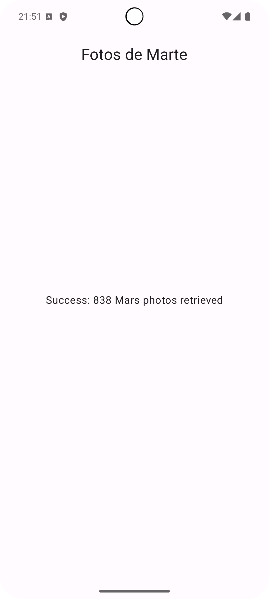

# 🚀 Mars Photos: Crónicas Marcianas 👽

¡Bienvenido a **Mars Photos**! 📸 Una aplicación de demostración que te trae las últimas imágenes de la superficie de Marte. ¡No son imágenes cualquiera, son fotos reales capturadas por los rovers de la NASA en el planeta rojo! 🛰️ Los datos se obtienen de un servicio web REST.

Esta aplicación demuestra el uso de tecnologías de vanguardia de Android:

*   **[Retrofit](https://square.github.io/retrofit/):** 🌐 para realizar solicitudes REST al servicio web.
*   **[kotlinx.serialization](https://github.com/Kotlin/kotlinx.serialization):** 📦 para convertir la respuesta JSON en objetos de datos de Kotlin.
*   **[Coil](https://coil-kt.github.io/coil/):** 🖼️ para cargar y mostrar imágenes desde una URL.
*   **[Jetpack Compose](https://developer.android.com/jetpack/compose):** 🎨 para construir una interfaz de usuario moderna y declarativa.

## 📋 Prerrequisitos

Para entender el código de esta aplicación, necesitas estar familiarizado con:

*   Creación de funciones Composable.
*   Uso de componentes de arquitectura como `ViewModel`.
*   Uso de corrutinas para tareas de larga duración.
*   El componente `LazyVerticalGrid` de Jetpack Compose.

## 🚀 Cómo empezar

1.  **[Instala Android Studio](https://developer.android.com/studio/install.html)**, si aún no lo tienes. 💻
2.  **Descarga el proyecto.** 📥
3.  **Importa el proyecto en Android Studio.** 📂
4.  **¡Compila y ejecuta la aplicación!** ▶️

## 🖼️ Captura de Pantalla

¡Así se ve la aplicación en acción!

  

